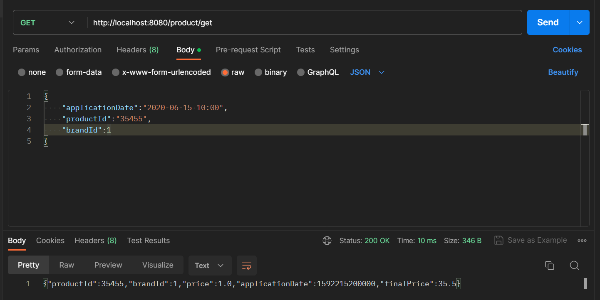
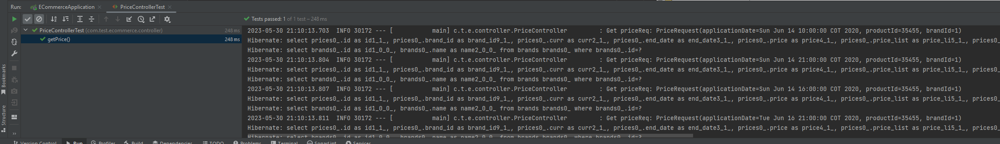
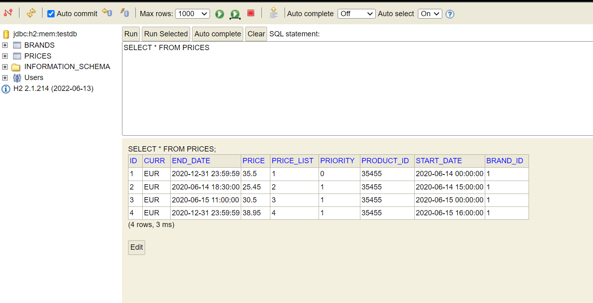

### Requisitos
- Java 11 
- Maven 3
- Lombok

### Compilar

mvn clean install

### Iniciar

mvn spring-boot:run

### Test

mvn test

### Nota

Se deja activa la consola de h2 en la direccion http://localhost:8080/h2-console

